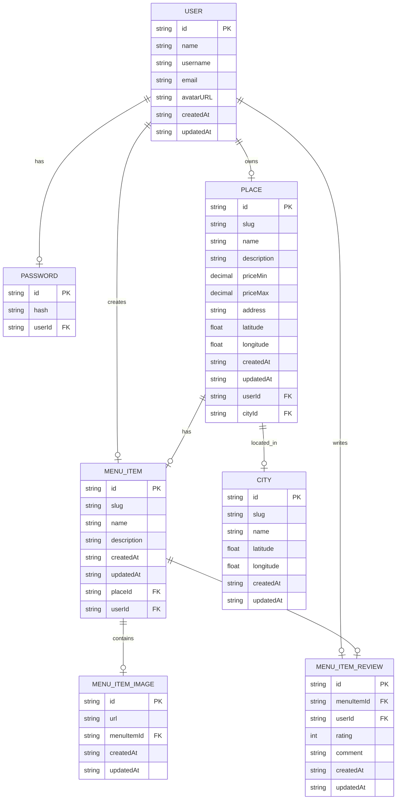

# FeastFind API

## Getting Started

Copy and edit `.env` file:

```sh
cp .env.example .env
```

Setup database:

```sh
# Run database only
docker:up
```

Install dependencies:

```sh
bun install
```

Migrate database and generate Prisma Client:

```sh
bun db:migrate
# prisma migrate dev && prisma generate
```

Seed initial products:

```sh
bun db:seed
# prisma db seed
```

Check data on studio:

```sh
bun db:studio
# prisma studio
```

Run development server:

```sh
bun dev
# bun run --hot src/index.ts
```

Open <http://localhost:3000>.

## Production

Make sure the `DATABASE_URL` is configured in `.env` file for usage with Docker Compose.

Build the Docker image:

```sh
bun docker:build
# docker compose up -d --build
```

If only run the Docker container:

```sh
bun docker:up
# docker compose up -d
```

Open <http://localhost:3000>.

## ERD


