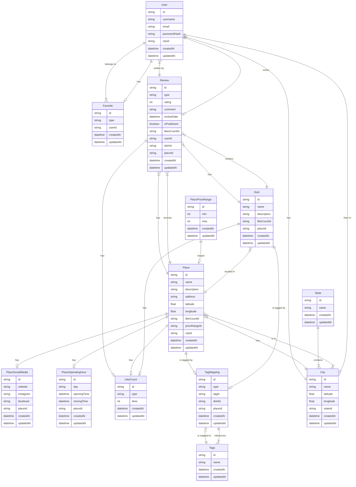

# FeastFind API

## ERD

```mermaid
erDiagram
    User {
        string id
        string username
        string email
        string passwordHash
        string cityId
        datetime createdAt
        datetime updatedAt
    }

    Favorite {
        string id
        string type
        string userId
        datetime createdAt
        datetime updatedAt
    }

    Dish {
        string id
        string name
        string description
        string likeCountId
        string placeId
        datetime createdAt
        datetime updatedAt
    }

    Place {
        string id
        string name
        string description
        string address
        float latitude
        float longitude
        string likeCountId
        string priceRangeId
        string cityId
        datetime createdAt
        datetime updatedAt
    }

    PlaceSocialMedia {
        string id
        string website
        string instagram
        string facebook
        string placeId
        datetime createdAt
        datetime updatedAt
    }

    PlaceOperatingHour {
        string id
        string day
        datetime openingTime
        datetime closingTime
        string placeId
        datetime createdAt
        datetime updatedAt
    }

    PlacePriceRange {
        string id
        int min
        int max
        datetime createdAt
        datetime updatedAt
    }

    Review {
        string id
        string type
        int rating
        string comment
        datetime reviewDate
        boolean isPublished
        string likesCountId
        string userId
        string dishId
        string placeId
        datetime createdAt
        datetime updatedAt
    }

    LikeCount {
        string id
        string type
        int likes
        datetime createdAt
        datetime updatedAt
    }

    TagMapping {
        string id
        string type
        string tagId
        string dishId
        string placeId
        datetime createdAt
        datetime updatedAt
    }

    Tags {
        string id
        string name
        datetime createdAt
        datetime updatedAt
    }

    City {
        string id
        string name
        float latitude
        float longitude
        string stateId
        datetime createdAt
        datetime updatedAt
    }

    State {
        string id
        string name
        datetime createdAt
        datetime updatedAt
    }

    User ||--o| Favorite : "has"
    User ||--o| Review : "writes"
    User ||--|{ City : "lives in"
    Favorite }|--|| User : "belongs to"
    Dish ||--o| LikeCount : "has"
    Dish ||--o| TagMapping : "is tagged by"
    Dish ||--|{ Review : "has"
    Dish }|--|| Place : "located in"
    Place ||--o| LikeCount : "has"
    Place ||--o| PlaceOperatingHour : "has"
    Place ||--o| PlaceSocialMedia : "has"
    Place ||--o| TagMapping : "is tagged by"
    Place ||--|{ Review : "has"
    Place }|--|{ City : "is in"
    PlacePriceRange ||--o| Place : "ranges"
    Review ||--o| LikeCount : "has"
    Review ||--|{ User : "written by"
    Review }|--|| Dish : "reviews"
    Review }|--|| Place : "reviews"
    TagMapping ||--|{ Tags : "references"
    Tags ||--o| TagMapping : "is mapped to"
    City ||--|{ Place : "has"
    City ||--|{ User : "has"
    State ||--|{ City : "contains"
```
