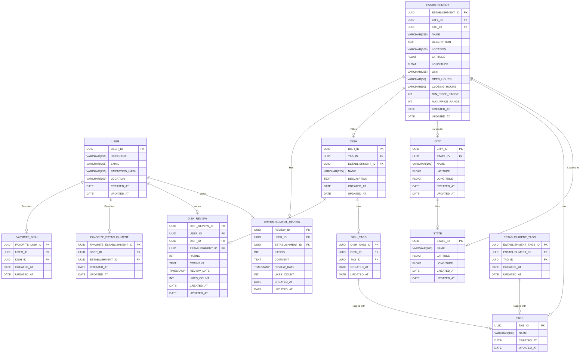

# FeastFind API

## ERD

```mermaid
erDiagram
    USER {
        UUID USER_ID PK
        VARCHAR(255) USERNAME
        VARCHAR(255) EMAIL
        VARCHAR(255) PASSWORD_HASH
        VARCHAR(100) LOCATION
        DATE CREATED_AT
        DATE UPDATED_AT
    }
    FAVORITE_DISH {
        UUID FAVORITE_DISH_ID PK
        UUID USER_ID FK
        UUID DISH_ID FK
        DATE CREATED_AT
        DATE UPDATED_AT
    }
    FAVORITE_ESTABLISHMENT {
        UUID FAVORITE_ESTABLISHMENT_ID PK
        UUID USER_ID FK
        UUID ESTABLISHMENT_ID FK
        DATE CREATED_AT
        DATE UPDATED_AT
    }

    DISH {
        UUID DISH_ID PK
        UUID TAG_ID FK
        UUID ESTABLISHMENT_ID FK
        VARCHAR(255) NAME
        TEXT DESCRIPTION
        DATE CREATED_AT
        DATE UPDATED_AT
    }
    DISH_REVIEW {
        UUID DISH_REVIEW_ID PK
        UUID USER_ID FK
        UUID DISH_ID FK
        UUID ESTABLISHMENT_ID FK
        INT RATING
        TEXT COMMENT
        TIMESTAMP REVIEW_DATE
        INT LIKES_COUNT
        DATE CREATED_AT
        DATE UPDATED_AT
    }

    STATE {
        UUID STATE_ID PK
        VARCHAR(100) NAME
        FLOAT LATITUDE
        FLOAT LONGITUDE
        DATE CREATED_AT
        DATE UPDATED_AT
    }
    CITY {
        UUID CITY_ID PK
        UUID STATE_ID FK
        VARCHAR(100) NAME
        FLOAT LATITUDE
        FLOAT LONGITUDE
        DATE CREATED_AT
        DATE UPDATED_AT
    }

    ESTABLISHMENT {
        UUID ESTABLISHMENT_ID PK
        UUID CITY_ID FK
        UUID TAG_ID FK
        VARCHAR(255) NAME
        TEXT DESCRIPTION
        VARCHAR(100) LOCATION
        FLOAT LATITUDE
        FLOAT LONGITUDE
        VARCHAR(255) LINK
        VARCHAR(50) OPEN_HOURS
        VARCHAR(50) CLOSING_HOURS
        INT MIN_PRICE_RANGE
        INT MAX_PRICE_RANGE
        DATE CREATED_AT
        DATE UPDATED_AT
    }
    ESTABLISHMENT_REVIEW {
        UUID REVIEW_ID PK
        UUID USER_ID FK
        UUID ESTABLISHMENT_ID FK
        INT RATING
        TEXT COMMENT
        TIMESTAMP REVIEW_DATE
        INT LIKES_COUNT
        DATE CREATED_AT
        DATE UPDATED_AT
    }

    TAGS {
        UUID TAG_ID PK
        VARCHAR(100) NAME
        DATE CREATED_AT
        DATE UPDATED_AT
    }
    DISH_TAGS {
        UUID DISH_TAGS_ID PK
        UUID DISH_ID FK
        UUID TAG_ID FK
        DATE CREATED_AT
        DATE UPDATED_AT
    }
    ESTABLISHMENT_TAGS {
        UUID ESTABLISHMENT_TAGS_ID PK
        UUID ESTABLISHMENT_ID FK
        UUID TAG_ID FK
        DATE CREATED_AT
        DATE UPDATED_AT
    }

    USER ||--o| FAVORITE_DISH : "Favorites"
    USER ||--o| FAVORITE_ESTABLISHMENT : "Favorites"
    USER ||--o| DISH_REVIEW : "Writes"
    USER ||--o| ESTABLISHMENT_REVIEW : "Writes"

    DISH ||--o| DISH_REVIEW : "Has"
    DISH ||--o| DISH_TAGS : "Has"
    DISH_TAGS ||--o| TAGS : "Tagged with"

    ESTABLISHMENT ||--o| ESTABLISHMENT_REVIEW : "Has"
    ESTABLISHMENT ||--o| DISH : "Offers"
    ESTABLISHMENT ||--o| CITY : "Located in"
    ESTABLISHMENT ||--o| TAGS : "Has"
    ESTABLISHMENT ||--o| STATE : "Located in"
    ESTABLISHMENT_TAGS ||--o| TAGS : "Tagged with"
    
    CITY ||--o| STATE : "Has"
```
