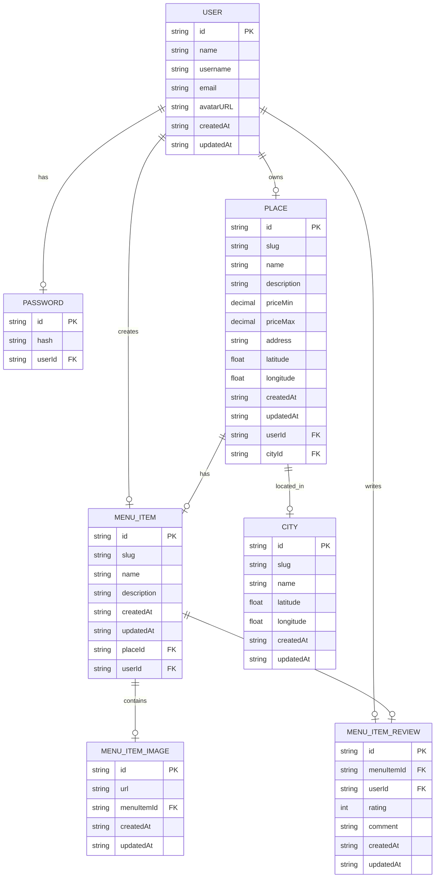

# FeastFind API

## ERD

```mermaid
erDiagram
    USER {
        string id PK
        string name
        string username
        string email
        string avatarURL
        string createdAt
        string updatedAt
    }

    PASSWORD {
        string id PK
        string hash
        string userId FK
    }

    PLACE {
        string id PK
        string slug
        string name
        string description
        decimal priceMin
        decimal priceMax
        string address
        float latitude
        float longitude
        string createdAt
        string updatedAt
        string userId FK
        string cityId FK
    }

    MENU_ITEM {
        string id PK
        string slug
        string name
        string description
        string createdAt
        string updatedAt
        string placeId FK
        string userId FK
    }

    MENU_ITEM_IMAGE {
        string id PK
        string url
        string menuItemId FK
        string createdAt
        string updatedAt
    }

    MENU_ITEM_REVIEW {
        string id PK
        string menuItemId FK
        string userId FK
        int rating
        string comment
        string createdAt
        string updatedAt
    }

    CITY {
        string id PK
        string slug
        string name
        float latitude
        float longitude
        string createdAt
        string updatedAt
    }

    USER ||--o| PASSWORD : has
    USER ||--o| PLACE : owns
    USER ||--o| MENU_ITEM : creates
    USER ||--o| MENU_ITEM_REVIEW : writes
    PLACE ||--o| MENU_ITEM : has
    PLACE ||--o| CITY : located_in
    MENU_ITEM ||--o| MENU_ITEM_IMAGE : contains
    MENU_ITEM ||--o| MENU_ITEM_REVIEW : receives
```